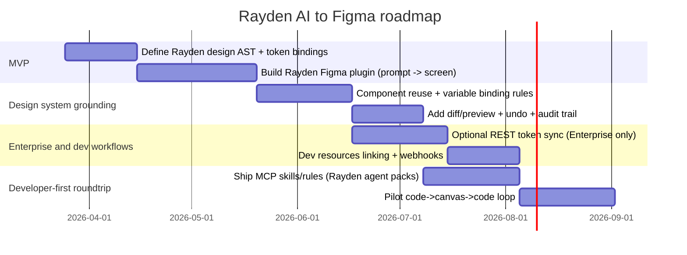
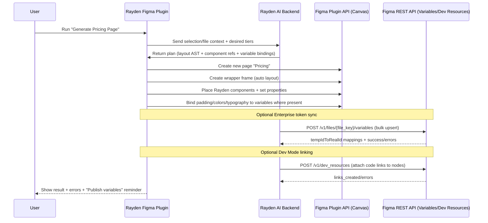

# Writing AI Agents to Figma Files: What’s Possible and How Rayden AI Could Implement It

## Executive summary

AI agents can now **write directly into Figma Design files** in a first-party way via the **Figma MCP server**, specifically through the `use_figma` tool (“write to canvas”). This is not a screenshot export; it creates and edits **native, structured Figma objects** (frames, components, variants, variables, auto layout, etc.). citeturn9view0turn19view0turn1view1

Under the hood, “write to canvas” works by allowing an MCP client to **execute JavaScript in the context of a Figma file via the Plugin API**, which is why it can create real design structure rather than just describing it. In practical terms, it is a controlled, agent-driven automation layer over the same capabilities Figma plugins already have. citeturn9view0turn30view0turn12view0

For Rayden AI, there are three viable implementation paths—each with different product/UX and enterprise implications:

- **Rayden Figma plugin (Plugin API) + Rayden AI backend**: most control, best designer UX, works widely (no MCP client dependency), and can generate/update full screens and components directly. citeturn30view0turn12view0  
- **Rayden “agent skills” / workflows that run in MCP clients using the Figma MCP server**: fastest way to prove “agent writes to canvas,” but the UX lives in external MCP clients (Cursor/VS Code/Claude Code/Codex), which is less productized for Rayden unless Rayden intends to ship a developer-first agent. citeturn15view0turn9view0turn14view0  
- **REST API for token/dev-workflow syncing + plugin or MCP for canvas edits**: the REST API is strong for reads and some specialized writes (variables, dev resources, comments), but **not** for arbitrary node-level canvas construction. Variables write access is also **Enterprise-gated**. citeturn25view0turn6view0turn1view3turn9view3  

Two constraints are especially load-bearing:

- **Write-to-canvas via MCP requires a Full seat + edit permission**; Dev seats are described as read-only for certain workflows. citeturn9view0  
- **Variables REST API (read/write) requires Enterprise + Full seat, and guests cannot use it**; many token-sync workflows are therefore Enterprise-only if you rely on REST for variables. citeturn1view3turn6view0turn9view3  

Finally, Figma states that the agent write feature is **free during the beta period** but is intended to become **usage-based paid**. That creates a real roadmap risk if Rayden’s core UX depends on `use_figma` pricing/limits. citeturn9view0turn14view0turn19view0

## Technical options

### MCP agent via the Figma MCP server

**What it is.** The Figma MCP server is a first-party MCP server that exposes tools for reading Figma context and (in some cases) writing back to files. Figma describes it as enabling agents to “write native Figma content back to the canvas.” citeturn1view1turn9view0

**Core write capability (“write to canvas”).** Figma’s `use_figma` tool is explicitly positioned as the “write to canvas” mechanism, and the docs describe it as producing real structure (frames, components, variables, auto layout) directly in a design file. citeturn9view0turn19view0

**How it works technically.** Figma states that write-to-canvas works by letting the client execute JavaScript “in the context of a Figma file through the Plugin API.” This is the critical architectural detail: it’s effectively “agent-controlled plugin execution,” not REST-based node writing. citeturn9view0turn12view0turn30view0

**Tooling surface.** Official tools include:
- read/context tools like `get_design_context`, `get_variable_defs`, `get_metadata`, `get_screenshot`  
- design-system discovery via `search_design_system`  
- write tools via `use_figma` (write-to-canvas) and `create_new_file`  
- “code to canvas” via `generate_figma_design` (convert live UI into editable layers) citeturn19view0turn4view2  

**Remote vs desktop server.**
- The **remote server** is the recommended setup and uses a hosted endpoint (`https://mcp.figma.com/mcp`) with OAuth sign-in. citeturn15view0  
- The **desktop server** runs locally (documented as `http://127.0.0.1:3845/mcp`) and is enabled via the desktop app; Figma says it’s offered for some org/enterprise use cases but strongly recommends remote because remote has the broadest features. citeturn4view1  
- Desktop troubleshooting docs emphasize that the server only runs when the file is active in the desktop app. citeturn28view0  

**Auth/scopes model.** Remote setup explicitly uses **Figma’s OAuth flow** during MCP connection, and the `whoami` tool returns the authenticated user identity and plan/seat info. citeturn15view0turn19view0

**Rate limits and access.** Figma ties MCP server access to plan/seat and enforces tool call limits (daily and per-minute). The docs also note that rate limits apply to tools that *read* data from Figma, while some specific tools are exempt. citeturn1view2turn4view0turn1view1  

A subtle but important detail: the “exempt tools” list explicitly includes `generate_figma_design`, `add_code_connect_map`, and `whoami`; it does **not** list `use_figma`. Conservatively, Rayden should assume `use_figma` calls count toward tool usage limits unless Figma updates the exemption list. citeturn1view2turn19view0

**Beta/paid status.** Figma repeatedly states (docs and blog) that agent write-to-canvas is currently free during beta but is planned as a usage-based paid feature. citeturn9view0turn14view0turn19view0

image_group{"layout":"carousel","aspect_ratio":"16:9","query":["Figma Dev Mode MCP server inspect panel","Figma variables panel design tokens","Figma plugin UI modal iframe","Figma auto layout components library"],"num_per_query":1}

### Figma Plugin API

**What it is.** Plugins run inside Figma files and can **read and write** the document tree (“nodes”)—including creating and modifying layers, frames, text, hierarchy, and properties. citeturn30view0turn1view4

**Capabilities relevant to “agent writes to file.”** The Plugin API is explicitly described as supporting “read and write access” to editors and allowing developers to “view, create, and modify the contents of files.” citeturn30view0turn1view4

**Key limitations that shape agent design.**
- Plugins must be **user-initiated**, are typically **short-lived**, and cannot run in the background. Figma adds: only one plugin and one action can run at a time; and plugins can’t perform actions in the background. citeturn30view0turn12view2  
- Access constraints: plugins cannot freely reach into external libraries unless assets are imported, and have restrictions around fonts and metadata access (many metadata concerns are REST-API territory). citeturn30view0turn1view4  
- Execution model: plugin code runs on the **main thread** in a sandbox without browser APIs; browser APIs live in an iframe UI, with message passing between the two environments. This matters for latency, streaming responses, and long-running LLM integration. citeturn12view0turn30view0  
- Performance: Figma explicitly notes plugins can freeze the UI due to the main-thread tradeoff, and recommends chunking work and yielding to keep the UI responsive. citeturn12view1  

**Why this is important for Rayden.** Figma’s MCP write-to-canvas itself is implemented *through* the Plugin API execution model, which implies many of the same practical constraints (document complexity, chunking, responsiveness) apply whether Rayden uses MCP or builds its own plugin-first agent. citeturn9view0turn12view1

### Figma REST API (variables and other write endpoints)

**What it is.** The REST API is the primary way to read file structure (JSON nodes), render images, manage comments, dev resources, webhooks, and—critically—manage variables via dedicated endpoints. citeturn25view0turn25view4

**What it can’t do (for canvas writes).** The REST scopes include `file_content:read` but do not provide a general “file content write” scope; the API is positioned around reading/extracting objects plus specialized write domains (comments, dev resources, variables). Practically, the REST API is not the tool for “draw arbitrary frames and layers” in the way plugins and `use_figma` are. citeturn6view0turn25view0

**Variables REST API (tokens).**
- Variables endpoints support querying and bulk create/update/delete operations. citeturn1view3turn9view3  
- Constraints: the bulk write endpoint is atomic, the request body must be ≤4MB, collections can have up to 40 modes, collections up to 5000 variables, and you can’t update remote variables (only those created in the file). citeturn9view3  
- Enterprise gating: variables read/write scopes are marked “Enterprise plan only,” and the Variables REST API requires a Full seat in an Enterprise org; guests cannot use it. citeturn6view0turn1view3turn9view3  
- Publishing: if you update variables via the REST API, Figma notes you will need to publish them before they can be used in other files. citeturn1view3  

**Other REST “write” endpoints useful to Rayden’s ecosystem.**
- Comments: the API supports posting/deleting comments and reactions. citeturn25view3turn6view0  
- Dev resources: you can bulk create/update/delete dev resources (developer links shown in Dev Mode) with `file_dev_resources:write`. Figma positions this for bi-directional linking workflows (example: Jira integration). citeturn25view1turn25view2turn6view0  
- Webhooks: enable event-driven workflows when things happen in files/projects/teams (with documented limits and permissions). citeturn18view0turn6view0  

**Auth and rate limits.** REST supports access tokens and OAuth2, and uses granular scopes; Figma also documents per-plan/per-seat rate limits by “Tier,” and notes updated limits in effect as of Nov 17, 2025. citeturn25view0turn5view1turn7view0

## Typical agent workflows and required tools

A workable “agent edits a Figma file” workflow is less about one API call and more about **orchestrating context → planning → incremental edits → validation**. Figma’s own guidance now formalizes this pattern via “skills” (repeatable instruction bundles) and specific MCP tools. citeturn20view0turn14view0turn19view0

**Connect and authenticate.**  
- For MCP remote: the official setup uses Figma OAuth during server connection; supported clients include developer tools like Claude Code and Codex by entity["company","OpenAI","ai research company"], among others. citeturn15view0turn9view0turn14view0  
- For plugins: authentication is implicit in the user running the plugin; external services are reached via network requests configured in plugin manifest (domain allowlist). citeturn30view0turn4view5  
- For REST: you authenticate with OAuth2 or access tokens and request the relevant granular scopes. citeturn25view0turn5view1turn6view0  

**Acquire target context.**  
- MCP remote is explicitly **link-based**: you pass a file URL or “link to selection,” and the server extracts the node-id. Figma notes that selection-based prompting only works with the desktop MCP server; remote requires a link. citeturn9view0turn19view0turn4view1  
- For large targets, Figma provides `get_metadata` as a lightweight outline so the agent can selectively call heavier context tools only where needed. citeturn19view0turn23view0  

**Design system discovery.**  
- `search_design_system` is intended to locate components/variables/styles across connected libraries to encourage reuse instead of generating bespoke layers. citeturn19view0  
- `get_variable_defs` returns variables/styles used in a selection, which helps align edits with tokens rather than raw values. citeturn19view0  

**Plan edits and implement incrementally.**  
Figma’s write-to-canvas docs and skill ecosystem imply a best practice: plan the frame structure, then perform incremental writes (e.g., section-by-section), validating between steps. This matches the constraints of complex documents and tool-call limits. citeturn20view0turn19view0turn1view2  

**Write back to canvas.**
- MCP path: call `use_figma` (usually through the `figma-use` skill) to create/update objects. citeturn19view0turn20view0turn9view0  
- Plugin path: directly create and modify nodes via the Plugin API, with your own orchestration logic. citeturn30view0  

**Validate.**  
- MCP provides `get_screenshot` to preserve and verify layout fidelity. citeturn19view0  

**Token sync vs layout sync (important distinction).**  
Figma explicitly differentiates “code to canvas” (`generate_figma_design`, which imports live UI as editable layers) from “write to canvas” (`use_figma`, which builds using your design system). Their recent product messaging frames these tools as complementary in a roundtrip workflow. citeturn4view2turn14view0turn9view1  

## Security, permissions, and enterprise constraints

### Permissions and access boundaries

Across both REST and MCP, Figma emphasizes that **scopes do not override file permissions**—you can only access files you created or that are shared with you through teams/projects. This matters for Rayden: you can’t build a “global agent” that edits arbitrary customer files unless the user authorizes access and has rights in those files. citeturn6view0

For MCP write-to-canvas specifically, Figma requires:
- a **Full seat** to write to files with agents, and
- **edit permission** on the target file. citeturn9view0  

For the Variables REST API specifically, Figma requires:
- **Enterprise org + Full seat** (and guests are excluded), and
- edit access to call the POST variables endpoint on a file. citeturn1view3turn9view3turn6view0  

### OAuth and app publishing constraints

If Rayden uses the REST API at production scale (token sync, dev resources, comments, webhooks), Figma’s docs emphasize registering an OAuth app, supporting token refresh, and handling the distinction between draft/private/public OAuth apps (with review required for public apps). Figma also notes developer-platform updates requiring OAuth apps to be re-published and granular scopes to be justified. citeturn5view1turn5view2  

### Auditability and enterprise governance

There are two relevant logging layers for Rayden:

- **Figma’s organization activity logs**: the Activity Logs API is Enterprise-only, admin-only, and designed for security events and SIEM integration. Events include actor, action, entity, and context such as IP and client name. This can help enterprise customers audit *who did what*, but it is not guaranteed to capture high-level “Rayden intent” unless Rayden adds its own audit trail. citeturn27view0turn27view2  
- **Plugin execution visibility**: Figma’s help docs note you “can’t see what plugins another user has run in a file,” and the plugin docs state Figma doesn’t provide analytics/error reporting for plugin usage. That is a governance gap for any Rayden plugin-based agent unless Rayden implements its own logging and/or enterprise reporting. citeturn12view2turn30view0  

### Plan/seat coupling risks

A real operational constraint: MCP limits can be tied to the **team/workspace where the file lives**, not just the user’s seat purchase. Figma community support explicitly points this out when troubleshooting tool call limits. For Rayden, this means “it works in one file but not another” can be a predictable class of support issue unless your onboarding detects and explains plan/team placement. citeturn21view0turn1view2  

### Security posture considerations for “agent writes to file”

From first principles, agent write-to-canvas is powerful because it introduces a tool execution channel into a high-value design surface. The MCP specification itself flags that protocols enabling arbitrary tool/data access create meaningful security and trust obligations. citeturn31view0  

Figma’s plugin review guidelines also indicate the platform expectation here: they may reject plugins that read or modify files “without a user’s explicit awareness and consent,” and they encourage developers to disclose security data practices. citeturn17view0  

Separately (third-party perspective), entity["company","Salt Security","api security company"] published an analysis of a disclosed “Figma MCP vulnerability” (Oct 9, 2025), framing it as an example of how MCP-like channels can become targets if input validation and operational guardrails are weak. Even if Rayden never runs its own MCP server, this is relevant as a cautionary tale for any “agent ↔ design tool” bridge. citeturn32view0  

## Developer experience and UX tradeoffs

### Latency and reliability characteristics

**Plugin-first (inside Figma)** tends to feel fastest for canvas edits because node creation/modification is local to the editor, but any AI inference still depends on the model/backend choice and network calls from plugin UI. Plugin runtime design matters because the main-thread sandbox can freeze when performing large operations, and Figma recommends chunking/yielding to keep the UI responsive. citeturn12view0turn12view1turn30view0  

**MCP-first (inside IDE/CLI)** introduces additional hops (client ↔ MCP server ↔ file context) and has failure modes tied to selection size, model timeouts, and client compatibility. Figma’s own troubleshooting emphasizes that large, nested selections can overwhelm context and cause slowdowns or failures, and that connectivity/tool-loading issues often depend on whether the underlying server is active (especially for desktop/local server). citeturn29view0turn28view0turn4view1  

### Background/long-running agents vs user-invoked actions

A key product design fork:

- Plugins must be manually run, can’t run in the background, and users can only run one plugin/action at a time. This strongly pushes Rayden plugin UX toward “session-based generation/editing” with clear user initiation and explicit preview/apply steps. citeturn12view2turn30view0  
- MCP clients can support longer-lived “agent sessions” in developer tooling, but Rayden does not control the UX unless it ships its own client (or deeply integrates into existing ones). Figma’s remote server docs are written around using external MCP clients rather than embedding the experience in a third-party product UI. citeturn15view0turn9view0  

### UX alignment with Rayden’s likely users

If Rayden AI is primarily for **designers** (and design-system maintenance), a **Figma plugin** is usually the most coherent surface: it’s discoverable in Figma, runs where the work happens, and can show visual diffs and “apply/revert” affordances.

If Rayden AI is primarily for **developers** (“generate the Figma screen from the codebase / implement the design / roundtrip”), the MCP model maps well because it is already embedded in dev tools and can combine “design context → code generation → push back to canvas.” Figma’s March 2026 release notes explicitly talk about “two-way workflows” across coding environments using the MCP server. citeturn9view1turn14view0  

## Architecture options for Rayden AI

Below are four concrete architectures that satisfy “an AI agent can write directly to Figma files,” with differing dependencies on Figma MCP vs Plugin vs REST.

```mermaid
flowchart LR
  U[User in Figma] --> P[Rayden Figma Plugin]
  P -->|selection + prompt| B[Rayden AI Backend]
  B -->|plan + layout AST| P
  P -->|create/modify nodes| FA[Figma Plugin API / Canvas]

  B -->|token sync (optional)| REST[Figma REST API: Variables + Dev Resources]
  REST --> DS[Figma Variables / Dev Resources]

  DEV[Developer in IDE] --> MCPClient[MCP Client]
  MCPClient -->|tools| FMCP[Figma MCP Server]
  FMCP -->|use_figma / read tools| FA
  MCPClient -->|Rayden rules/skills| B
```

### Plugin-only

**What it is.** A Rayden Figma plugin that runs a Rayden agent in a controlled way: read current selection, pull Rayden design system rules, and write nodes/components/variables directly using Plugin API calls. citeturn30view0turn12view0  

**Pros.** Strongest “Rayden-native” experience; works without requiring users to install/understand MCP clients; full fidelity for document edits; can enforce Rayden conventions at the point of creation. citeturn30view0turn19view0  

**Cons.** Plugins can’t run in background and are user-initiated; main-thread execution can freeze on large operations; publishing to Community may require review and security disclosures. citeturn30view0turn12view1turn17view0  

**Required components.** Figma plugin (TypeScript/JS + UI iframe), Rayden backend for LLM planning, optional storage for audit logs & prompts, optional token store.

**Effort estimate.** Medium (MVP) to High (production-grade with robust UX, caching, audit, enterprise controls).

**Example stack.** Plugin: TypeScript + React UI; Backend: Node.js or Python; Auth: Rayden account + optional OAuth to Figma REST for token/dev resources syncing; Hosting: AWS/GCP; Observability: OpenTelemetry + log store.

### MCP-only

**What it is.** Rayden AI ships as “skills/rules” (or a Rayden agent wrapper) that users run inside MCP-enabled tools, relying on the Figma MCP server’s `use_figma` tool to write to the canvas. citeturn9view0turn20view0turn15view0  

**Pros.** Fastest path to feature parity with Figma’s “agent writes to canvas” narrative; leverages Figma’s existing MCP toolchain and supported client ecosystem; naturally pairs with code generation and Code Connect workflows. citeturn14view0turn19view0turn15view0  

**Cons.** Rayden’s UX depends heavily on third-party MCP clients; write-to-canvas requires Full seat; pricing is in flux (beta → usage-based paid); tool-call limits and client compatibility become support surface area. citeturn9view0turn1view2turn21view0  

**Required components.** Rayden skill packs / rules (likely markdown-based patterns as Figma describes skills), optional Rayden backend for design-system intelligence, documentation for setup across clients. citeturn14view0turn20view0  

**Effort estimate.** Low to Medium for an MVP that works in a couple of clients; Medium for broad client coverage + tooling polish.

**Example stack.** Skills/rules distribution: GitHub repo + installer scripts; optional backend: same as above; plus integration docs for clients.

### Hybrid: plugin + backend + MCP

**What it is.** Rayden provides a Figma plugin for designers, plus MCP-oriented skills for developers. Both share a backend “design system brain” so “pricing page generation” behaves consistently whether initiated in Figma or in code-first workflows. citeturn9view1turn20view0turn30view0  

**Pros.** Best coverage: designer-native and developer-native entrypoints; lets Rayden gradually adopt MCP as it stabilizes/prices; makes Rayden resilient to any single integration’s limitations. citeturn9view0turn30view0  

**Cons.** Higher engineering and product complexity; requires tight definition of Rayden’s intermediate representation (layout AST / component graph / token bindings) to keep behavior consistent. (This is an implementation inference.)

**Required components.** Plugin, backend, “Rayden design system compiler,” optional MCP skill packages, shared audit logging and caching.

**Effort estimate.** High.

**Example stack.** Same as plugin-only + skills distribution + optional “policy engine” (rules) to enforce Rayden conventions.

### REST token-sync hybrid

**What it is.** Use REST primarily for what it’s good at: token and linking workflows (variables/dev resources/comments/webhooks), while using Plugin API or MCP for actual canvas layout edits. citeturn25view0turn25view1turn9view3turn9view0  

**Pros.** Strong enterprise story for design-system governance, CI-driven token sync, dev resource linkage, webhook-driven automation. citeturn1view3turn25view1turn18view0  

**Cons.** Variables REST is Enterprise-gated and has bulk payload constraints; you still need Plugin/MCP for true “agent draws screens.” citeturn9view3turn6view0turn9view0  

**Effort estimate.** Medium (if enterprise-only) to High (if you need equivalent non-enterprise fallback via plugin variables).

### Recommended phased roadmap for Rayden AI

Figma’s direction (March 2026) suggests agents can now “design directly on the canvas,” with `use_figma` + skills as the core abstraction, but also signals ongoing gaps (working toward Plugin API parity, starting with image support/custom fonts). Rayden should assume some churn. citeturn14view0turn9view0  



**Near-term next steps (most leverage).**
1. Validate Rayden’s core UX by prototyping “pricing page generation” as a Figma plugin that reuses existing Rayden components and variables (minimum external dependencies). citeturn30view0turn19view0  
2. In parallel, validate an MCP workflow using Figma’s official `use_figma` tool + `search_design_system` to measure how reliably it can find and reuse Rayden components from libraries. citeturn9view0turn19view0turn15view0  
3. Decide whether REST Variables API is an enterprise-only upsell or whether Rayden needs a non-enterprise fallback for token import/export using the Plugin API (Figma explicitly supports variables via Plugin API). citeturn16view0turn6view0turn1view3  

## Practical implementation checklist and reference flow

### Comparison table

| Attribute | MCP via Figma MCP server | Plugin API | REST API (variables + other writes) |
|---|---|---|---|
| Writes arbitrary layout to canvas | Yes via `use_figma` (write to canvas). citeturn9view0turn19view0 | Yes (create/modify nodes). citeturn30view0 | No general canvas write; specialized writes only (variables/dev resources/comments). citeturn6view0turn25view0 |
| How writes are executed | JS executed in file context via Plugin API. citeturn9view0 | Direct node manipulation in plugin runtime. citeturn30view0turn12view0 | HTTP endpoints; bulk operations for variables/dev resources; etc. citeturn25view0turn9view3turn25view2 |
| Background / long-running | Depends on MCP client; tool calls limited; remote/desktop differences. citeturn1view2turn4view1 | No background; user-invoked; one at a time. citeturn30view0turn12view2 | Yes (server-side jobs), but only for supported endpoint domains. citeturn25view0turn18view0 |
| Token access and sync | `get_variable_defs` for used tokens; can also create variables via `use_figma`. citeturn19view0turn9view0 | Variables supported; can create/read/bind variables. citeturn16view0 | Strong for variable CRUD but Enterprise-only; publish required for cross-file use. citeturn1view3turn9view3turn6view0 |
| Enterprise suitability | Good if org has Full seats; watch MCP tool-call limits and team/workspace coupling. citeturn9view0turn21view0turn1view2 | Good for internal plugins; enterprise governance depends on Rayden audit. citeturn30view0turn12view2 | Best for enterprise governance (activity logs, variables API) but gated by plan/scopes. citeturn27view0turn6view0turn1view3 |
| Complexity | Medium (depends on client support + future pricing). citeturn9view0turn15view0 | Medium–High for polished UX and performance. citeturn12view1turn17view0 | Medium (for token/dev workflows), but limited scope. citeturn25view0turn9view3 |

### Checklist for a production-grade Rayden AI → Figma integration

**Foundation and user flows**
- Define a stable internal “design intent” representation: component instances (by key), layout constraints (auto layout), and variable bindings (mode-aware). (Implementation inference, but necessary to avoid one-off node spaghetti.)
- Decide your primary UX: “Generate screen” vs “Refactor selection” vs “Sync tokens” vs “Roundtrip code/canvas.” Figma’s tool split (`generate_figma_design` vs `use_figma`) strongly suggests keeping “rendered UI import” separate from “design-system-based generation.” citeturn4view2turn14view0turn9view0  

**Auth and permissioning**
- For REST usage: register an OAuth app; request minimal granular scopes. Typical baseline: `file_content:read` (read nodes), plus optional `file_dev_resources:write`, `file_comments:write`, and (Enterprise-only) `file_variables:read/write`. citeturn6view0turn5view1turn25view2  
- For MCP usage: ensure the user has a Full seat and edit access if you need write-to-canvas. citeturn9view0turn1view2  

**Rate limits and batching**
- REST: implement 429 handling using `Retry-After` and associated headers; design for tiered budgets (Tier 1/2/3 and plan/seat dependent). citeturn7view0  
- MCP: anticipate tool-call limits per plan/seat, and that some workflows can be gated by which team/workspace the file lives in. citeturn1view2turn21view0  
- Variables REST: batch changes; respect 4MB payload; use temporary IDs; treat writes as atomic (all-or-nothing). citeturn9view3  

**Plugin architecture**
- Use the iframe UI for network calls and model streaming; keep main-thread node operations chunked to avoid freezing. citeturn12view0turn12view1  
- Restrict network domains in `manifest.json` to what’s required (security + review). citeturn4view5turn17view0  
- Provide explicit “preview/apply” and clear user consent before modifying documents (aligns with Figma review expectations). citeturn17view0  

**Testing and QA**
- Test on large, nested files; handle dynamic page loading and async APIs when accessing non-current pages. citeturn30view0  
- Validate generated output through screenshots (MCP `get_screenshot`) or internal diff heuristics. citeturn19view0  

**Costs and uncertainty management**
- Treat MCP write-to-canvas pricing and quotas as volatile until Figma publishes final billing; design Rayden so the plugin-only path remains viable even if MCP gets expensive or restricted. citeturn9view0turn14view0  

### Example prompts and tooling patterns

```text
MCP prompt pattern (write-to-canvas):
Using this Figma file URL: <file-url>
1) Use search_design_system to find Rayden pricing card, Rayden buttons, and typography + spacing variables.
2) Create a "Pricing" page and build a full pricing screen (desktop 1440) using auto layout and only Rayden components.
3) Bind all spacing and color to variables; avoid raw values.
4) After each section, use get_screenshot and fix layout issues before proceeding.
```

```text
Figma plugin UI pattern (designer-first):
- Input: “Generate Pricing Page”
- Options: plan tiers (3/4), layout (cards/table), theme mode (light/dark), density (compact/comfortable)
- Actions:
  1) Validate Rayden library connection
  2) Generate into new page with a preview frame
  3) Apply (writes to canvas), Undo last apply, Export spec
```

These patterns align with Figma’s positioning of `use_figma` + `search_design_system` + screenshot-based validation, and with Figma’s guidance that skills encode repeatable, reliable workflows. citeturn19view0turn20view0turn14view0  

### Sample sequence for the use case: “Generate a pricing page using Rayden components and sync tokens”

Below is a concrete hybrid flow that uses the best tool for each job: **Plugin API for layout generation**, **REST Variables API for token sync (Enterprise only)**, plus optional **dev resources linking**.



**Why this sequence is realistic given Figma’s current platform:**
- The Plugin API can create/modify file contents (frames/components/text/layout), but plugins are user-invoked and can’t run in background. citeturn30view0turn12view2  
- The Variables REST API supports bulk upsert/delete with clear constraints, but is Enterprise + Full-seat + edit-access gated, and updates may require publishing before reuse across files. citeturn9view3turn1view3turn6view0  
- Dev resources APIs support bi-directional linking workflows and are immediately available (no publish step), making them useful for connecting Rayden components to code references. citeturn25view1turn25view2  

### Real-world examples and demos to anchor feasibility

- Figma’s March 24, 2026 blog post “Agents, meet the Figma canvas” explicitly announces agents designing directly on the canvas via MCP + `use_figma`, and lists community-authored skills including token sync patterns (e.g., `/sync-figma-token`). It also quotes a Codex design lead at entity["company","OpenAI","ai research company"] about using Figma with Codex workflows. citeturn14view0  
- Official developer docs show end-to-end setup of the remote MCP server across multiple MCP clients, including OAuth authentication and installation guidance for Claude Code (by entity["company","Anthropic","ai research company"]) and other environments. citeturn15view0turn9view0  
- The Dev Resources REST API documentation points to “Figma’s Jira integration” as an example of programmatically attaching and syncing dev links between Figma nodes and external systems. (This is a concrete precedent for Rayden attaching “implementation links” to Rayden components.) citeturn25view1  

### Risks, unknowns, and recommended next steps

The biggest “unknown” is commercial and operational: `use_figma` is explicitly planned to become usage-based paid, and MCP call limits depend on plan/seat and even on where the file lives. Rayden should de-risk by ensuring a plugin-only pathway can deliver core value. citeturn9view0turn21view0turn1view2  

The second risk is capability maturity: Figma publicly states they are still working toward parity with the Plugin API and call out areas like image support and custom fonts as future work. If Rayden’s design output depends on these, it should plan for partial support and fallbacks. citeturn14view0turn9view0  

The third risk is enterprise gating on token automation: if “sync tokens” must be automated for all customers, relying on the Variables REST API will exclude non-enterprise customers; Rayden will need plugin-based token import/export as a fallback. citeturn1view3turn16view0turn6view0  

A pragmatic next-step sequence:

1. Build a Rayden plugin MVP that can generate a pricing page using existing Rayden components and bind variables where available. citeturn30view0turn19view0  
2. In parallel, prototype the same use case using MCP `use_figma` + `search_design_system` to evaluate reliability and cost/limits sensitivity. citeturn9view0turn19view0turn1view2  
3. Decide on token sync strategy (Enterprise REST vs plugin-based sync), and—if enterprise is in scope—add auditability hooks using organization activity logs and Rayden’s own action logs. citeturn27view0turn12view2turn30view0